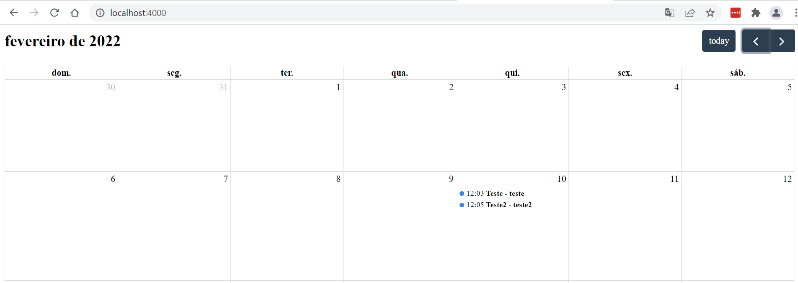

# Agendamento
<br>
<div align="center">


<!--  -->
  


</div>

<!--


-->
> Um aplicativo de agendamento genérico com notificações de calendário e e-mail.
> ## 💻 Pré-requisitos

Antes de começar, certifique-se de atender a estes requisitos requisitos:

* Você instalou a versão estável mais recente do `Node`

## 🚀 Configuração do projeto

Para instalar, siga estes passos:

Clone o projeto e execute o comando no diretório raiz:
```
npm  install
```
## ☕ Usando Agenda

#### Execute este comando em seu CMD no caminho ./src:
```
node index.js
```

Bom teste!
<div>
    
</div>
